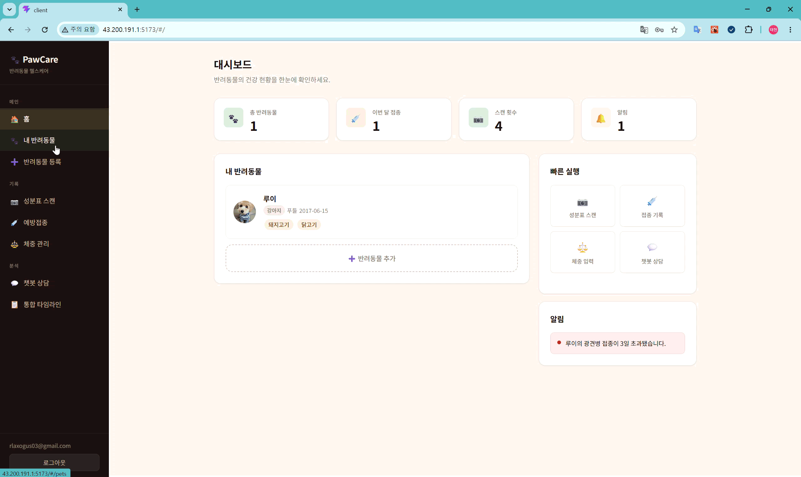

# Paw Care

> 강아지·고양이 보호자가 일상 데이터(체중·음식·접종·증상)를 기록해서
> 병원 가기 전에 미리 위험을 알아챌 수 있게 도와주는 **웹 서비스** 프로젝트.

**팀**: 김태현(총괄) · 김기연 · 장윤서 · 김찬영
**개발 기간**: 6주
---
## Screenshot


---
## 접속

**[PawCare](http://43.200.191.1:5173/)**
```
http://43.200.191.1:5173/
```

---
## 주요기능


---
## 주요 파일

| 파일 | 무슨 내용 | 언제 보면 되나 |
|---|---|---|
| **[`function.md`](function.md)** | 누가 어떤 기능을 만들고, 어떤 자료조사를 할지 |  본인 할 일 확인 |
| **[`PLAN.md`](PLAN.md)** | 시스템 설계, 화면 구성, DB 구조, 기능별 상세 명세 | 구현하다 막힐 때 참조 |
| **[`RESEARCH.md`](RESEARCH.md)** | 왜 이 기능을 만드는지 배경 조사 | 처음에 프로젝트 이해할 때 |
| **[`TODO.md`](TODO.md)** | 6주 일정 초안 + 주차별 할 일 | 회의에서 확정한 뒤 활용 |
| **[`/research`](RESEARCH.md)** | 자료조사 내용 | 자료조사 |

---

## 프로젝트 한 줄 요약

- **무엇을**: 반려동물 헬스케어 웹 (체중·위험음식·예방접종 통합 관리)
- **왜**: "병원을 최대한 적게 가기 위해 사전에 대비"
- **어떻게**: 사용자가 데이터를 입력하면 자동으로 기록하고 위험요소 알림

---

## 기술 스택

| 분야 | 기술 | 링크 |
|---|---|--- |
| 프론트엔드 |   | [client](./client/README.md)|
| 백엔드 |   | [server](./server/README.md) |
| 데이터베이스 |  | - |
| 스토리지 | AWS S3 | - |
| 배포 | EC2 (프론트) + EC2 (백엔드) | - |
| 외부 API | OpenAi API / Naver Clova OCR| - |

---

## 참고
login email/pw  
test@test.com/test1234@@  
rlaxogus03@gmail.com/test1234@@@
