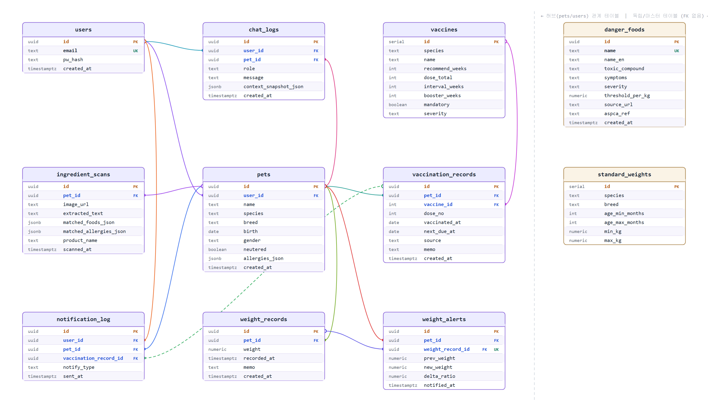

# 백엔드 명세

## ERD

## API 명세

- 인증: 로그인 시 발급되는 httpOnly 쿠키(`access_token`)로 처리. 🔒 = 인증 필요, 🌐 = 공개
- Base URL: `/api`

| Method | Endpoint | 인증 | 기능 |
|---|---|---|---|
| GET | `/health` | 🌐 | 서버 상태 확인 |
| POST | `/api/auth/register` | 🌐 | 회원가입 |
| POST | `/api/auth/login` | 🌐 | 로그인 (쿠키 발급) |
| POST | `/api/auth/logout` | 🌐 | 로그아웃 (쿠키 제거) |
| GET | `/api/auth/me` | 🔒 | 현재 로그인 사용자 정보 조회 |
| POST | `/api/pets` | 🔒 | 반려동물 등록 (사진 업로드 포함) |
| GET | `/api/pets` | 🔒 | 내 반려동물 목록 조회 |
| DELETE | `/api/pets/:petId` | 🔒 | 반려동물 삭제 |
| GET | `/api/vaccines?species=dog\|cat` | 🌐 | 백신 마스터 목록 조회 |
| GET | `/api/pets/:petId/vaccinations` | 🔒 | 펫의 접종 이력 조회 |
| POST | `/api/pets/:petId/vaccinations` | 🔒 | 접종 이력 추가 |
| DELETE | `/api/pets/:petId/vaccinations/:id` | 🔒 | 접종 이력 삭제 |
| GET | `/api/pets/:petId/weights` | 🔒 | 체중 기록 목록 조회 |
| POST | `/api/pets/:petId/weights` | 🔒 | 체중 기록 추가 (급변 판정 포함) |
| DELETE | `/api/pets/:petId/weights/:id` | 🔒 | 체중 기록 삭제 |
| GET | `/api/pets/:petId/timeline` | 🔒 | 통합 타임라인 조회 (체중·접종·스캔) |
| POST | `/api/ocr/scan?petId=<uuid>` | 🔒 | 이미지 OCR 변환·분류 (저장 X) |
| POST | `/api/ingredient-scans/confirm` | 🔒 | 성분표 스캔 결과 확정 저장 |
| GET | `/api/ingredient-scans?petId=<uuid>` | 🔒 | 성분표 스캔 이력 조회 |
| GET | `/api/pets/:petId/chat` | 🔒 | 챗봇 대화 이력 조회 |
| POST | `/api/pets/:petId/chat` | 🔒 | 챗봇 메시지 전송·응답 |
| GET | `/api/notifications` | 🔒 | 대시보드 알림 조회 (접종 D-day 등) |
| POST | `/api/admin/notify-check` | 🌐 | 알림 체크 수동 트리거 (개발용) |
